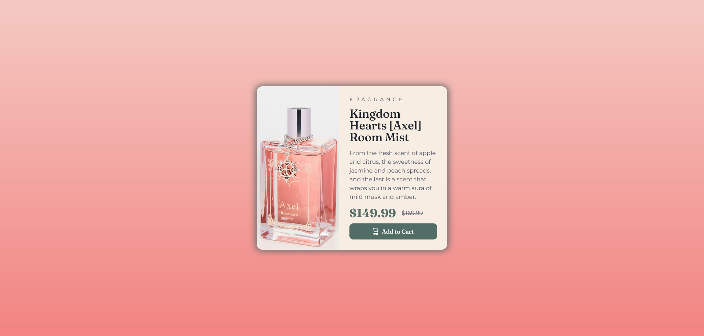

# Frontend Mentor - Product preview card component solution

This is a solution to the [Product preview card component challenge on Frontend Mentor](https://www.frontendmentor.io/challenges/product-preview-card-component-GO7UmttRfa). Frontend Mentor challenges help you improve your coding skills by building realistic projects.

## Table of contents

- [Overview](#overview)
  - [The challenge](#the-challenge)
  - [Screenshot](#screenshot)
  - [Links](#links)
- [My process](#my-process)
  - [Built with](#built-with)
  - [What I learned](#what-i-learned)
  - [Continued development](#continued-development)
- [Author](#author)

## Overview

### The challenge

Users should be able to:

- View the optimal layout depending on their device's screen size
- See hover and focus states for interactive elements

### Screenshot

### Links

- Solution URL: (https://www.frontendmentor.io/solutions/product-preview-card-component-Y2WcYCPhC2)
- Live Site URL: (https://genuinemiyashita.github.io/Product-Preview-Card/)

## My process

I started with semantic HTML5 markup and ensuring that it passed through W3C's HTML validator. Afterwards, I used a mobile-first approach by using FireFox's developer tools for the responsive mode and using a iPhone 12/13 pro as my screen sample. With the CSS, I worked from the top-down approach and passed it through W3C's CSS validator too.

### Built with

- Semantic HTML5 markup
- CSS custom properties
- Flexbox
- Mobile-first workflow

### What I learned

My biggest take-away was handling the media queries and figuring out how to prevent the information from breaking inbetween breakpoints, primarly the text area. I learned that using min-width (aside from the media query) was the solution.

### Continued development

I want to continue development on HTML and CSS, but primarily responsive design and flexbox. I'm aiming to start incorporating Bootstrap and others in future projects.

## Author

- Frontend Mentor - [@GenuineMiyashita](https://www.frontendmentor.io/profile/GenuineMiyashita)
